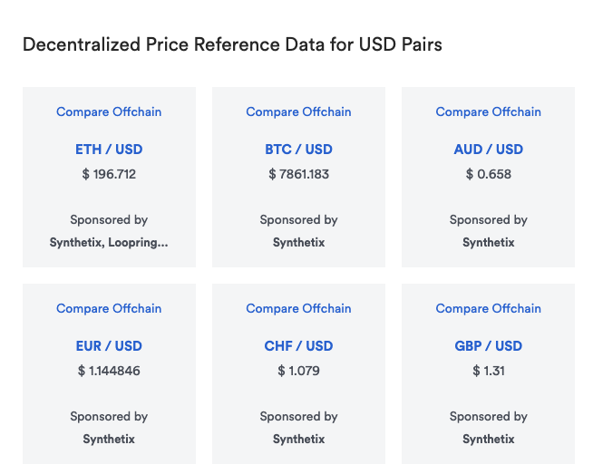

# Chainlink Heartbeat ETH/USD network graph

This project was bootstrapped with [Create React App](https://github.com/facebook/create-react-app).

## Available Scripts

In the project directory, you can run:

### `npm start:dev`

Runs the app in the development mode.<br>
Open [http://localhost:3000](http://localhost:3000) to view it in the browser.

The page will reload if you make edits.<br>
You will also see any lint errors in the console.

### `npm test`

Launches the test runner in the interactive watch mode.<br>
See the section about [running tests](https://facebook.github.io/create-react-app/docs/running-tests) for more information.

### `npm run build`

Builds the app for production to the `build` folder.<br>
It correctly bundles React in production mode and optimizes the build for the best performance.

The build is minified and the filenames include the hashes.<br>
Your app is ready to be deployed!

See the section about [deployment](https://facebook.github.io/create-react-app/docs/deployment) for more information.

### `npm run start`

Launches the expressjs server that serve the `/build` folder

## Deploy to Heroku

[Official heroku docker documentation](https://devcenter.heroku.com/articles/container-registry-and-runtime)

Enable Docker container builds on the application

```
$ heroku stack:set container -a the-app-name

```

Login to the Heroku Docker container registry

```
$ heroku container:login

```

Build and push a new image from the root of the monorepo

```
$ heroku container:push --recursive --arg REACT_APP_INFURA_KEY=abc123,REACT_APP_GA_ID=abc123 -a the-app-name

# If the config vars are stored in Heroku, you can capture the output in a subshell
$ heroku container:push --recursive --arg REACT_APP_INFURA_KEY=$(heroku config:get REACT_APP_INFURA_KEY -a the-app-name),REACT_APP_GA_ID=$(heroku config:get REACT_APP_GA_ID -a the-app-name) -a the-app-name
```

Deploy the newly built image by releasing the container from the root of the monorepo

```
$ heroku container:release web -a the-app-name
```

## Hidden Features

### Display Offchain Comparison Links

On the landing page you can enable a link to an offchain price comparison resource with the `compare-offchain` query parameter.

```
https://feeds.chain.link?compare-offchain=true
```



### Display Reference Contract Health

On the landing page you can enable live health checks with:

```
https://feeds.chain.link?health=true
```


#### Checks

- Within price threshold
- Answer is 0

Color Codes

- Red: A check has failed (hover for tooltip that includes failed checks)
- Yellow: Unknown status (when the price health check is not configured)
- Green: Ok
